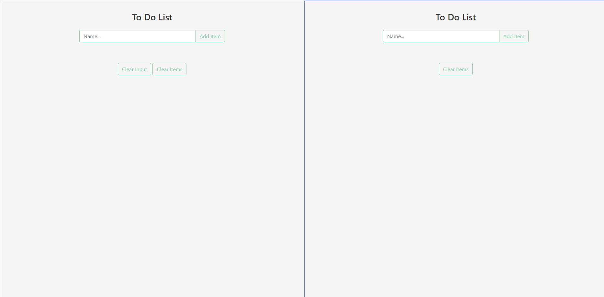

# Todo List Project

How to do this ToDo list.
If you don't know what to do, first read about the project [here](https://jsbeginners.com/todo-list-javascript-project-v1/)

Don't do like me ^^

For my part,
	1. i've download the project from the [github source](https://github.com/JS-Beginners/todo-list-project-2)
	1. Load the app in a local server ( npx http-server on node or use live-server extension in VsCode)
	1. Recode it my way without looking at the solution
	1. If need to go back, i will take a look to the [live vesion](https://js-beginners.github.io/todo-list-project-2/)

Good coding time.

---
i've deleted the Jquery and Bootstrap js files as they are evil.
---

#### Coding the project

We keep the variable selection/intialization
```Javascript

 // initialize variable
const form = document.querySelector('#itemForm'); // select form
const itemInput = document.querySelector('#itemInput'); // select input box from form
const itemList = document.querySelector('.item-list');
const feedback = document.querySelector('.feedback');
const clearButton = document.querySelector('#clear-list');
const clearInput = document.querySelector('#clear-input');
const submit = document.querySelector('button[type="submit"]');


```

I'm starting the js file by cleaning its content but I keep the selectors and variables.
i
1. I start to create an Immediately Invoked Function Expressions ( IIFE )


```Javascript
	(() => {
		// add your content here
	})();
```


The app have a button to clear items, but not a button to reset the input.
Even if i don't care about the html and css files, i want to add it.
```Javascript
	     <button type="button" class="btn btn-green my-3 text-capitalize" id="clear-input">clear input</button>
```
added in the html code. The id naming is based on the clear-list button



Added the clear event to the button

```Javascript
	(() => {
		// add your content here
		// Clear input content when the user clicks on the button
    clearInput.addEventListener('click', () => {
        itemInput.value = '';
    })
	})();
```

We notice that, from the task list, if you have a task added and refresh the page,
your tasks persist between refresh.
We can use localStorage for this

```Javascript

    // Clear input content when the user clicks on the button
    clearInput.addEventListener('click', () => {
        itemInput.value = '';
    })

    // create tasks array, to store each task inside
    const tasks = [];

    // At first, when the page load,  look for tasks in localStorage
    // if some task exists, we use JSON.parse to retrieve the tasks
    // don't forget that we same them in an array,
    // so we can use the spread operator to retrieve them and push them in the tasks array
    //
    // for each item, we call the function addNewTsskItem with the task name
    // and an index, we use the index from the forReach array here, so they are unique
    if(localStorage.hasOwnProperty('tasks')) {
        tasks.push(...JSON.parse(localStorage.getItem('tasks')))
        tasks.forEach((task,index) => itemList.innerHTML += addNewTaskItem(task,index))
    }
```
We make use of a new create function addNewTaskItem. This function create the html for displaying the task.

```Javascript
/**
 * @param { string } task : the text content of the task
 * @param { number } id : an unique identifiant for the task
 **/
function addNewTaskItem(task,id) {

    // the html code is from the index.html file, in the comment
    return `<div class="item my-3" data-id="${id}">
      <h5 class="item-name text-capitalize">${task}</h5>
      <div class="item-icons">
       <a href="#" class="complete-item mx-2 item-icon"><i class="far fa-check-circle"></i></a>
       <a href="#" class="edit-item mx-2 item-icon"><i class="far fa-edit"></i></a>
       <a href="#" class="delete-item item-icon"><i class="far fa-times-circle"></i></a>
      </div>
     </div>`
    }


```


#### Delete the task in the list
We need to remove the task from the lisk when the user want to remove it
For this, we need to know the element clicked,
i choose to pass it as a parameter to the function use to remove the html element
```Javascript

    /**
     * @params { string } target : the current element targetted by the click
     *
     **/
    function removeTask(target) {

        // we gp to the top element under the container,
        // we need, in our case, go through 3 parent element
        // item > item-icons > a

        let root = target.parentElement.parentElement.parentElement;

        // get the uniqeu id
        let id = root.dataset.id;

        // delete the task in the list at this unique id position
        tasks.splice(id-1,1);

        // replace tasks in localStorage with the new tasks list
        localStorage.setItem('tasks',JSON.stringify(tasks));

        // remove the html element parent for this task
        root.remove();
    }

```

##### Deal with the submit button

```Javascript
    // add Items to list
    submit.addEventListener('click', (e) => {

        // don't let the form to be send and have a page reload
        e.preventDefault()

        // get the task content (value)
        if(itemInput.value !== '') {

              // if there are content, add it to the task list
              // we use again the addNewTaskItem function/
              // itemInput.value are the content value in the input currently
              // for the unique id, we use the length of the task list
              // as the last item is at length-1, there are no value at the position length
              itemList.innerHTML += addNewTaskItem(itemInput.value,tasks.length)

              // push the taks in the task list array
              tasks.push(itemInput.value)

              // as localStoage can contain only string, we use JSON.stringify
              // to make it possible to add the array content in the localStoage
              localStorage.setItem('tasks',JSON.stringify(tasks));

              // set empty value for input ( clear its content)
              itemInput.value = '';
        } else {
            // The content is empty

            // 1. Create the error message
            feedback.textContent = `Please Enter Valid Value`;

            // 2. Show the Message
            feedback.classList.toggle('alert-danger');
            feedback.classList.toggle('showItem');

            // 3. Hide the message 3 sec later
            setTimeout(() => {
            feedback.classList.toggle('showItem');
            feedback.classList.toggle('alert-danger');
            },3000)

        }
    })
```

#### Make use of the icons

```Javascript

    // itemList represent one task in the list
    itemList.addEventListener('click', function(e) {

        // select the current element clicked
        let elementClassName = e.target.className;

        // select the current task item html element based on his class
        let currentTask = e.currentTarget.querySelector('.item-name');

        // if element is the icon to tell that the task is fullfilfed
        if(elementClassName.includes('fa-check-circle'))
        {
            // select the current task and add the class completed to i
            // a click on the same button toggle the class
            // so set completed or set uncompleted flag use the same action and function
            currentTask.classList.toggle('completed')
        } else {
            // if you wand to edit or delete the taks

            // for edit only, we add the current selected task to the input value
            if (elementClassName.includes('fa-edit')) {
              itemInput.value = currentTask.textContent;
            }

        // delete call this funciton, so we can call it once here
        // edit action remove the task too.
        removeTask(e.target);
        }

    })

```
