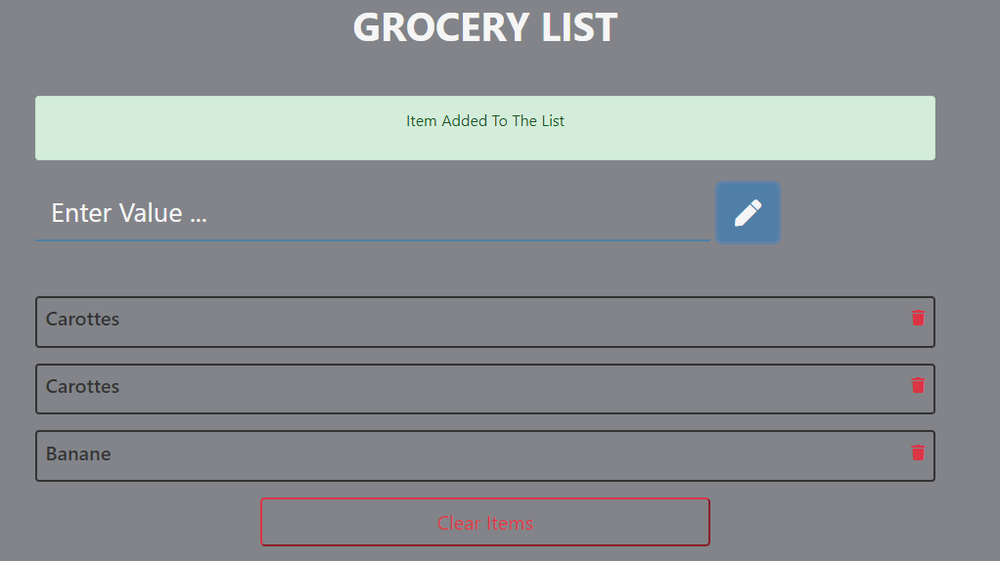

# 100 javascripts project for beginner
Project based on https://jsbeginners.com/javascript-projects-for-beginners/

but this is my own javascript code and how i will handle it.

What the goal ?
For me, learn by making this project, make search on solution for element I can't handle as it's a part of a developper to be able to find solution.

I encourage you to see and read too the code source and solution on [jsbegginer.com](https://jsbeginners.com/javascript-projects-for-beginners/)
as you will have another solution.

## This project => Grocery list

Before we start coding:
    Analyse what is actually done in the web page.
    

We have a clear button. When we click on it, nothing appear.
    No function here, no need too.

If we enter a value in the input field, nothing happen.
    For this element, we can add a method to clear the input when the list is cleared.

When we click on the pen button, we have an error message like this one:
    

I was waiting for a message more like "Nothing to edit". The pen icon mislead me.

When we have a value in the input and submit it, we have a message :
    

When deleting an element, nothing appear. We will add a message for a succesful deletion.

So let's start.

____

