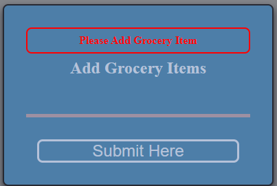
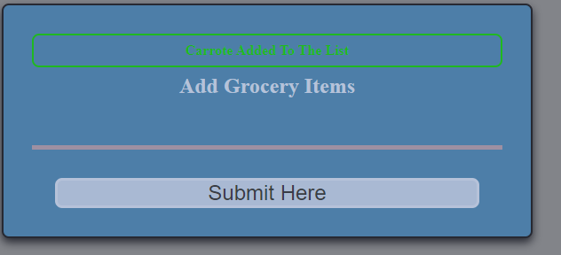
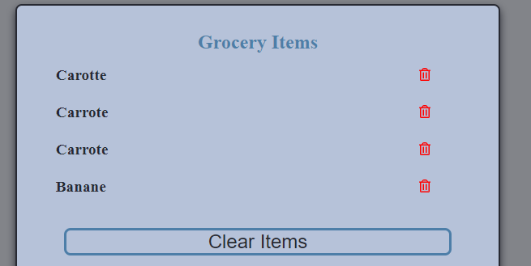

# grocery-list-todo-project 2

Before starting the project

Test of the online version [here](https://js-beginners.github.io/grocery-list-project-2/)

1. When we click on the "submit here" button with no item



Code to start the project  and add the error message
```Javascript


const msgError = "Please Add Grocery Item";
const MSG_DISPLAY_TIME = 3000;

(() => {
    /**
     *
     * @param {string} message Display a message to the user
     * @param {string} className class name associate to the type of message ( error, info, alert etc)
     */
    function displayMessage (message,className)   {
        addItemsAction.textContent = message;
        addItemsAction.classList.toggle(className);

        // message will be displayed 3 sec
        setTimeout(() => {
            addItemsAction.textContent = '';
            addItemsAction.classList.toggle(className);
        },MSG_DISPLAY_TIME);
    }

    /**
     * Do something when we click on the submit button. This
     * if no item, show an error message
     * if item, add it to the list
     */
    form.addEventListener('submit', (e) => {
        e.preventDefault();
        if(!input.value) {
            displayMessage(msgError,'alert');
        } else {

        }
    })
})();


```

###### When we click on the "submit here" button with a content


We have a different message and a new information color ( className "success" when looking at the source code)
For this, we added a new variable for the success message:
```
const msgSuccess = "Added to the list"
```
and modified the submit addEventEndler:

```Javascript
if(!input.value) {
    displayMessage(msgError,'alert');
} else {
    displayMessage(`${input.value} ${msgSuccess}`,'success');
}
```

Now we can add item to the list.


```Javascript
if(!input.value) {
    displayMessage(msgError,'alert');
} else {
    displayMessage(`${input.value} ${msgSuccess}`,'success');
    addItemToList(input.value);
}

```

and the function to add the item to the list ( html taken from source and delete from html file comment after)

```Javascript

/**
 * Take an item name and add the needed hml content to create an list item
 * before be injected into the grocery list item. We use afterbegin parameter
 * so we can see the item when added alwaays on top of the list
 *
 * @param {string} item name of the item to be added to the list
 *
 */
function addItemToList(item) {
    let listItemHtml = `<div class="grocery-item">
        <h4 class="grocery-item__title">${item}</h4>
        <a href="#" class="grocery-item__link">
            <i class="far fa-trash-alt"></i>
        </a>
    </div>`;

    list.insertAdjacentHTML('afterbegin',listItemHtml);
}

```

Now, we can see our item added to the list.

But when we refresh the page, we lost our items.
We need to make use of localStorage.
We create new variables.

````
// check if data exist in localStorage, grab it if exists or create an empty list ( array )
// if you forget to use Json.parse to get the array, you will have a message 'map/forEach' or
// whatever array method is not a funcion
const groceryList = localStorage.hasOwnProperty('groceryList') ?
    JSON.parse(localStorage.getItem('groceryList')) : [];
```

and we create a function to load the list on the page load.
The call to the function is to be added in the IIFE.
```
/**
* loop through the grocery list array and add item to the dom
*/
function loadListItems() {
    groceryList.map(item => addItemToList(item) )
}
```

Now, time to add the item localStorage to. For that, we need to modify our addItemToList function a bit.
The new addItemToList function =>

```
/**
 * Take an item name and add the needed hml content to create an list item
 * before be injected into the grocery list item. We use afterbegin parameter
 * so we can see the item when added alwaays on top of the list
 *
 * @param {string} item name of the item to be added to the list
 *
 */
function addItemToList(item, pushToList = true) {

        let listItemHtml = `<div class="grocery-item">
                <h4 class="grocery-item__title">${item}</h4>
                <a href="#" class="grocery-item__link">
                    <i class="far fa-trash-alt"></i>
                </a>
    </div>`;

    // add item to grocery list if it's not from localStorage
    pushToList && groceryList.unshift(item);

    // remote groceryList to localStorage;
    localStorage.removeItem('groceryList');

    // add new array to localStorage
    localStorage.setItem('groceryList',JSON.stringify(groceryList));

    // insert list html element to grocery list
    pushToList && list.insertAdjacentHTML('afterbegin',listItemHtml);

    !pushToList && list.insertAdjacentHTML('beforeend',listItemHtml);
}
```

#### Delete an item from the list.

We need to add an eventListener to the list in order to detect a clic on the trash bin.

Trash bin icons is not present at the start of the page, so we add the listener to the list element itself.

```Javascript
list.addEventListener('click',removeItemFromList);
```
i've add it after the loadItems() function.

and the removeItemFromList function is the following :
```Javascript
/**
 *
 * @param {childNode} el children element to remove from the html
 */
    function removeItemFromList(el) {
        // parent element
        // if not icon trash eelement
        if(el.target.dataset.icon !== "trash-alt") return false;

        const itemNode = el.target.parentNode.parentNode;
        // top position of the list item
        const itemPosition = Array.prototype.indexOf.call(list.childNodes, itemNode);

        // delete reference in groceryList array
        let position = itemPosition - 1;

        groceryList.splice(position, 1);

        // delete element from html interface
       itemNode.remove();

        // remove list from localStorage
        localStorage.removeItem("groceryList");

        // add New modified array in localStorage
        localStorage.setItem("groceryList", JSON.stringify(groceryList));

        el.stopPropagation();

    }
```

We stop the event is the class "trash-alt" is not found in the target element of the click event.

So, only the trash bin will give a result, so we can remove the selected element.

Lastly, we need to implement the clear button.
In the IIFE, we can add an event listen on the clear button.

```Javascript
  // ckear akk utels?
  clear.addEventListener('click',clearList)
```

and the clearList function :
```Javascript

function clearList() {
    // if there are a child, delete it
   while (list.firstChild) {
        list.removeChild(list.firstChild);
    }
    // reset the array
    groceryList.length = 0;

    // remove grocery list to the localStorage
    localStorage.hasOwnProperty('groceryList') && localStorage.removeItem('groceryList');

}

```
